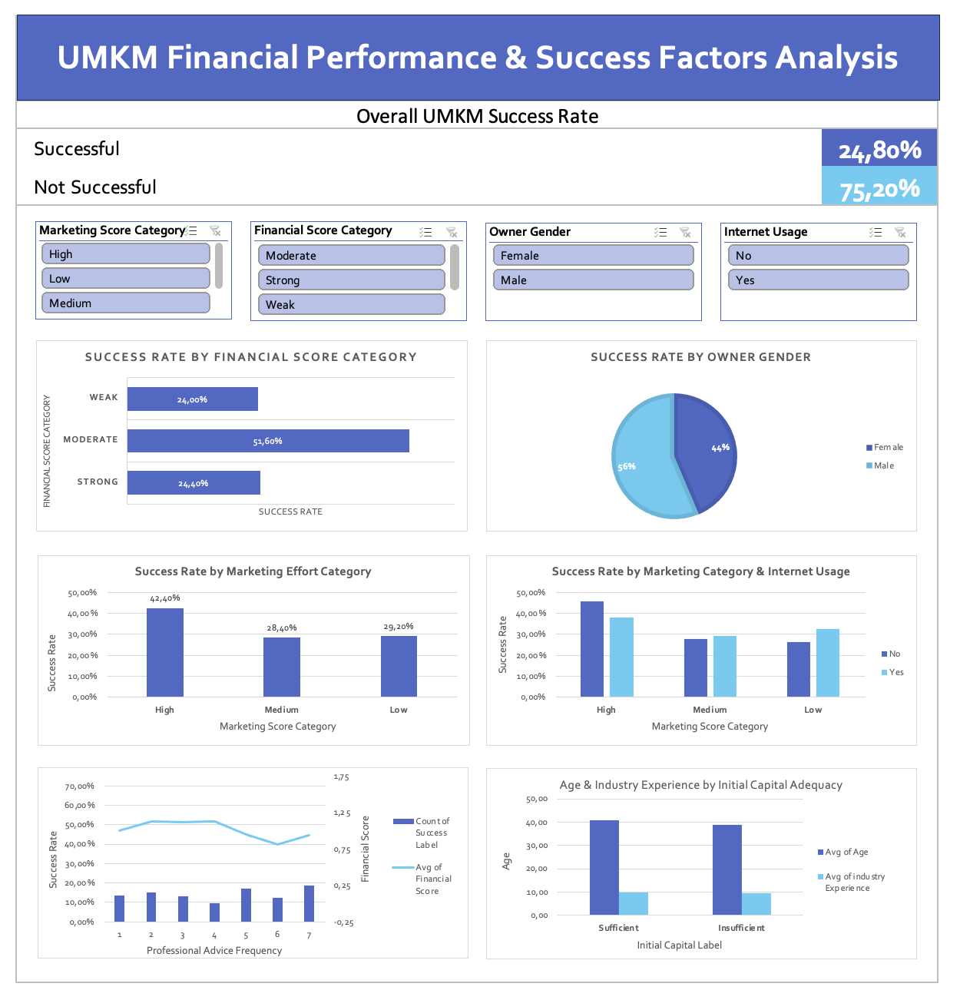

# UMKM Financial Performance & Success Factors Analysis – Excel Dashboard

**Advanced Excel Dashboard** | **251 Indonesian UMKM Profiles** | **Interactive Analysis**

## 📌 Project Overview

This project presents a comprehensive **interactive Excel dashboard** that analyzes the key success factors of Micro, Small, and Medium Enterprises (UMKM/MSMEs) in Indonesia.

The analysis focuses on **financial health**, **marketing efforts**, **digital adoption**, and **professional consultation** to identify actionable insights that can help improve UMKM success rates.

## 🔍 Key Insights

- **Overall UMKM Success Rate**: **24.80%** Successful
- **Best Performing Group**: UMKM with **Moderate Financial Score** have the **highest success rate (53.60%)**
- **Marketing Impact**: High marketing effort category achieves **42.40%** success rate (significantly higher than Medium & Low)
- **Gender**: Male-owned businesses show **56%** success rate vs **44%** for female-owned
- **Moderate financial discipline** outperforms both "Strong" and "Weak" categories in this dataset

## ❓ Business Questions Answered

1. What is the overall UMKM success rate?
2. Do businesses with "Strong" financial scores have higher success rates?
3. Is there a success rate gap between male-owned and female-owned UMKM?
4. How does marketing effort level affect success?
5. Does internet usage improve success, especially for low-marketing businesses?
6. Are businesses with adequate initial capital owned by younger or more experienced founders?
7. Does frequency of professional advice correlate with higher success?
8. Which factors should be prioritized to increase UMKM success rate?

## 🗂️ Dataset

- **Source**: [Kaggle - MSME Dataset](https://www.kaggle.com/datasets/eskobar/msme-dataset)
- **Records**: 251 UMKM profiles
- **Target Variable**: `status_keberhasilan` (1 = Successful, 0 = Not Successful)
- **Key Attributes**: Age, Education, Initial Capital, Financial Record Keeping, Marketing Effort, Internet Usage, Professional Advice, Industry Experience, Gender, etc.

**Derived Features**:
- `Financial_Score` & `Financial_Score_Category` (Strong / Moderate / Weak)
- `Marketing_Score_Category` (High / Medium / Low)
- Readable label columns for visualization

## 🛠️ Tools & Techniques Demonstrated

- **Power Query** (ETL, data cleaning, custom columns, conditional logic)
- **PivotTables & PivotCharts**
- **Interactive Slicers** (fully connected)
- **Advanced Dashboard Design** (KPI cards, combo charts, 100% stacked charts)
- **Data visualization best practices**
- **Business insight generation & recommendations**

## 📊 Dashboard Preview

---

👨‍💻 Created by: **David Sebastian Aritonang**  
📧 Email: [davidsebastianartt@gmail.com](mailto:davidsebastianartt@gmail.com)  
🔗 LinkedIn: [linkedin.com/in/david-sartt](https://www.linkedin.com/in/david-sartt/) 

## Dashboard Features

- Fully interactive slicers (Financial Score, Gender, Marketing Category, Internet Usage)
- Clean, professional layout with consistent color scheme
- Multiple chart types: Pie, 100% Stacked Bar, Clustered Column, Line + Column Combo
- Executive summary & actionable recommendations

## How to Explore

1. Download `UMKM_Financial_Dashboard.xlsx`
2. Enable editing (if prompted)
3. Go to **Dashboard** sheet
4. Use the slicers to interact with all charts simultaneously

## Author

**DataNerdID**  
Data Analyst Portfolio Project  
Built with ❤️ using Microsoft Excel (Advanced)

---

**Last Updated**: February 2026
